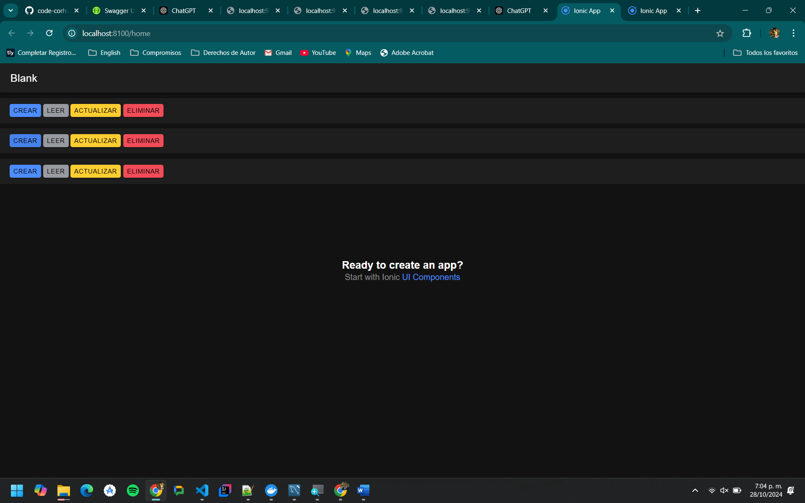

# tajskdfkj ngfdgds f

Componente de CRUD
```js
<template>
    
    <ion-item lines="none">
    <ion-button color="primary" @click="$emit('create')" expand="block">
      Crear
    </ion-button>
    <ion-button color="medium" @click="$emit('read')" expand="block">
      Leer
    </ion-button>
    <ion-button color="warning" @click="$emit('update')" expand="block">
      Actualizar
    </ion-button>
    <ion-button color="danger" @click="$emit('delete')" expand="block">
      Eliminar
    </ion-button>
  </ion-item>
  </template>
  
  <script>
  import { IonItem, IonLabel, IonInput } from '@ionic/vue';
  
  export default {
    name: 'CustomInput',
    components: {
      IonItem,
      IonLabel,
      IonInput,
    },
    props: {
      id: {
        type: String,
        required: true,
      },
      nombre: {
        type: String,
        required: true,
      },
      value: {
        type: String,
        default: '',
      },
      placeholder: {
        type: String,
        default: 'Enter value...',
      },
    },
  };
  </script>
  
  <style scoped>
  ion-item {
    margin: 10px 0;
  }
  </style>
  
```


Vista
```js
<template>
  <ion-page>
    <ion-header :translucent="true">
      <ion-toolbar>
        <ion-title>Blank</ion-title>
      </ion-toolbar>
    </ion-header>

    <ion-content :fullscreen="true">
      <ion-header collapse="condense">
        <ion-toolbar>
          <ion-title size="large">Blank</ion-title>
        </ion-toolbar>
      </ion-header>

      <div id="container">
        <strong>Ready to create an app?</strong>
        <p>Start with Ionic <a target="_blank" rel="noopener noreferrer" href="https://ionicframework.com/docs/components">UI Components</a></p>
      </div>

     
      <custom-input></custom-input>
      <custom-input></custom-input>
      <custom-input></custom-input>
      
    </ion-content>
  </ion-page>
</template>

<script setup lang="ts">
import { IonContent, IonHeader, IonPage, IonTitle, IonToolbar } from '@ionic/vue';
import CustomInput from '../components/CustomInput.vue';
</script>

<style scoped>
#container {
  text-align: center;
  
  position: absolute;
  left: 0;
  right: 0;
  top: 50%;
  transform: translateY(-50%);
}

#container strong {
  font-size: 20px;
  line-height: 26px;
}

#container p {
  font-size: 16px;
  line-height: 22px;
  
  color: #8c8c8c;
  
  margin: 0;
}

#container a {
  text-decoration: none;
}
</style>

```

Evidencia
